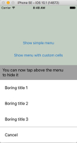

# DKPopupMenu

A fast and simple way to add Android-like looking popup menu anywhere in a project with API similar to UIAlertController, but simpler :)

Optionally, any nib file can be used to present menu cell's content.


[](https://travis-ci.org/DmytroKovryhin/DKPopupMenu)
[](http://cocoapods.org/pods/DKPopupMenu)
[](http://cocoapods.org/pods/DKPopupMenu)
[](http://cocoapods.org/pods/DKPopupMenu)

## Usage

To run the example project, clone the repo, and run `pod install` from the Example directory first.

## Requirements

## Installation

DKPopupMenu is available through [CocoaPods](http://cocoapods.org). To install
it, simply add the following line to your Podfile:

```ruby
pod "DKPopupMenu"
```

## Icons
Icons used in example are taken from [publicly available source](http://www.iconfinder.com) and are distibuted under [Creative Commons Attribution-No Derivative Works 3.0 Unported Lisence](http://creativecommons.org/licenses/by-nd/3.0/)

## Author

DmytroKovryhin, agnostic.88@yandex.ua

## License

DKPopupMenu is available under the MIT license. See the LICENSE file for more info.
